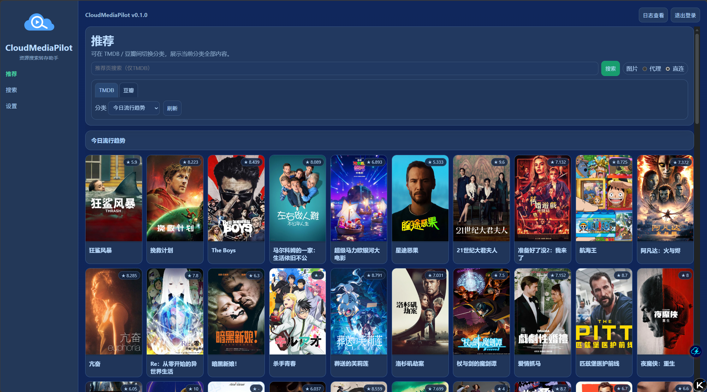
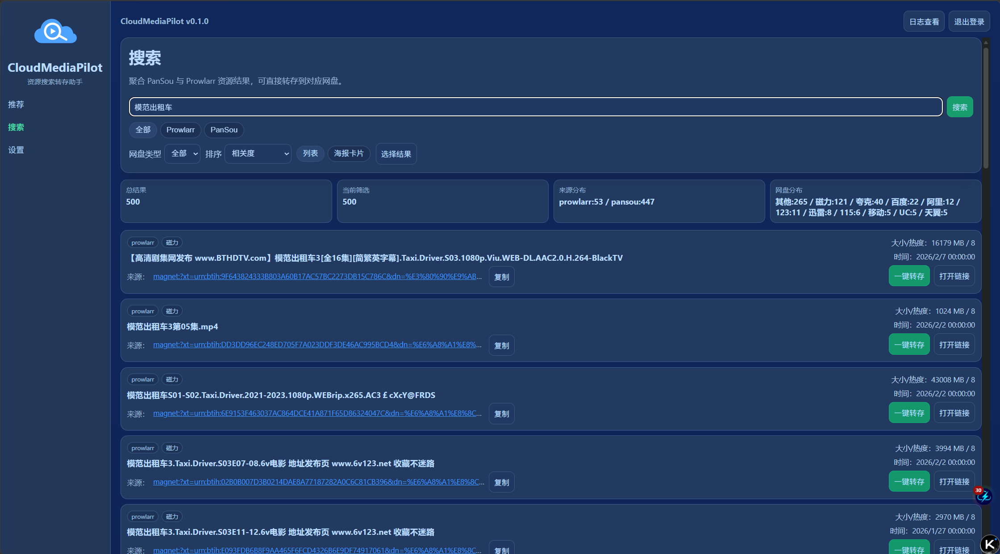
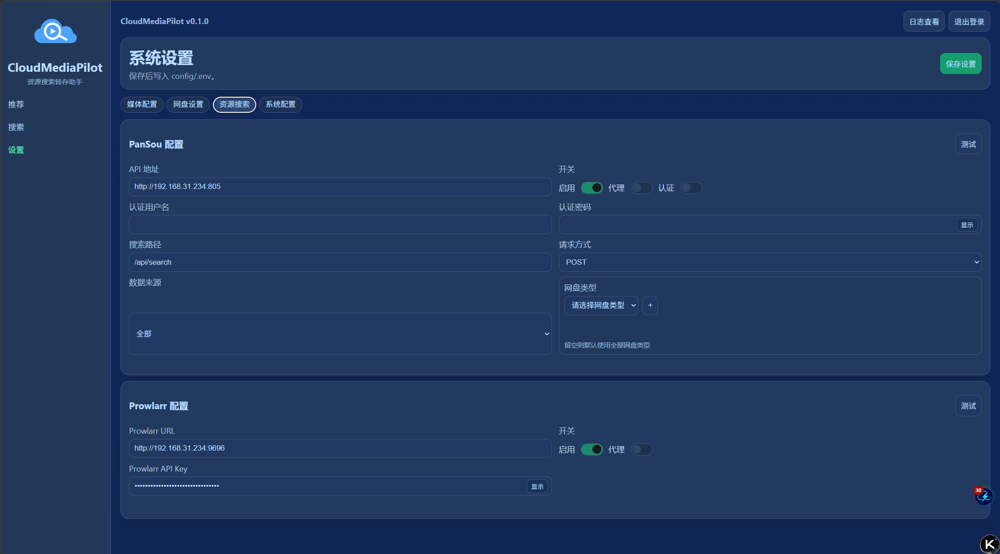

# CloudMediaPilot

CloudMediaPilot 是一个影视推荐、资源搜索和网盘转存助手。后端基于 FastAPI，WebUI 内置在后端服务中，打开浏览器即可使用。

主要功能：

- TMDB / 豆瓣推荐与影视搜索
- PanSou + Prowlarr 聚合资源搜索
- 115 / 夸克等网盘资源转存
- 115 磁力离线任务创建

GitHub：

https://github.com/BlueBlueKitty/CloudMediaPilot

## 界面预览

### 推荐页



### 搜索页



### 设置页



## Docker 部署

### 方式一：docker run

```bash
docker run -d \
  --name cloudmediapilot \
  -p 1315:1315 \
  -e SYSTEM_USERNAME=admin \
  -e SYSTEM_PASSWORD=admin \
  -e HTTP_PROXY=http://127.0.0.1:7890 \
  -e HTTPS_PROXY=http://127.0.0.1:7890\
  -v "$PWD/cloudmediapilot/config:/app/config" \
  -v "$PWD/cloudmediapilot/data:/app/data" \
  bluebluekitty/cloudmediapilot:latest
```

### 方式二：docker compose


```yaml
services:
  cloudmediapilot:
    image: bluebluekitty/cloudmediapilot:latest
    container_name: cloudmediapilot
    environment:
      SYSTEM_USERNAME: admin
      SYSTEM_PASSWORD: admin
      HTTP_PROXY: http://127.0.0.1:7890
      HTTPS_PROXY: http://127.0.0.1:7890
    ports:
      - "1315:1315"
    volumes:
      - ./config:/app/config
      - ./data:/app/data
    restart: unless-stopped
```

启动：

```bash
docker compose up -d
```

访问：`http://localhost:1315/`

### 部署变量说明

Docker 部署常用只需要关注这几项：

| 项 | 含义 |
| --- | --- |
| `./config:/app/config` | 配置目录。首次启动会自动生成 `/app/config/.env`，WebUI 保存设置也会写入这里。 |
| `./data:/app/data` | 数据目录。用于持久化运行期数据和后续扩展数据。 |
| `SYSTEM_USERNAME` | 首次自动生成配置时使用的 WebUI 登录用户名，默认 `admin`。 |
| `SYSTEM_PASSWORD` | 首次自动生成配置时使用的 WebUI 初始登录密码，默认 `admin`。 |
| `HTTP_PROXY` / `HTTPS_PROXY` | 容器内应用访问外网时使用的系统代理（推荐同时设置）。 |

## Docker 构建

本地构建镜像：

```bash
docker build -f backend/Dockerfile -t cloudmediapilot:local .
```

运行本地镜像：

```bash
docker run -d \
  --name cloudmediapilot \
  -p 1315:1315 \
  -e SYSTEM_USERNAME=admin \
  -e SYSTEM_PASSWORD=admin \
  -e HTTP_PROXY=http://192.168.31.234:20171 \
  -e HTTPS_PROXY=http://192.168.31.234:20171 \
  -v "$PWD/config:/app/config" \
  -v "$PWD/data:/app/data" \
  cloudmediapilot:local
```

发布到 Docker Hub 可使用脚本：

```bash
export DOCKERHUB_TOKEN=你的DockerHubToken
./scripts/dockerhub_publish.sh 0.1.0
```

脚本会构建并推送：

- `bluebluekitty/cloudmediapilot:0.1.0`
- `bluebluekitty/cloudmediapilot:latest`

## 本地运行

### 环境要求

- Python 3.11+
- 推荐使用虚拟环境
- 可选：`uv`（用于快速创建虚拟环境）

### 使用 uv 创建虚拟环境（推荐）

```bash
cd backend
uv venv --python 3.11
source .venv/bin/activate
cd ..
```

### 安装依赖

```bash
make install
```

### 启动服务

```bash
make run
```

打开：`http://localhost:1315/`

如需显式指定 Python 解释器（例如未激活虚拟环境时）：

```bash
make install PYTHON=backend/.venv/bin/python
make run PYTHON=backend/.venv/bin/python
```

## 常用开发命令

```bash
make test # 运行后端测试
make smoke-mock # mock 模式冒烟测试
make verify-secrets # 检查潜在敏感信息
```
